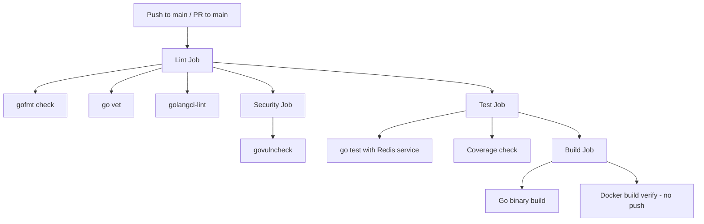
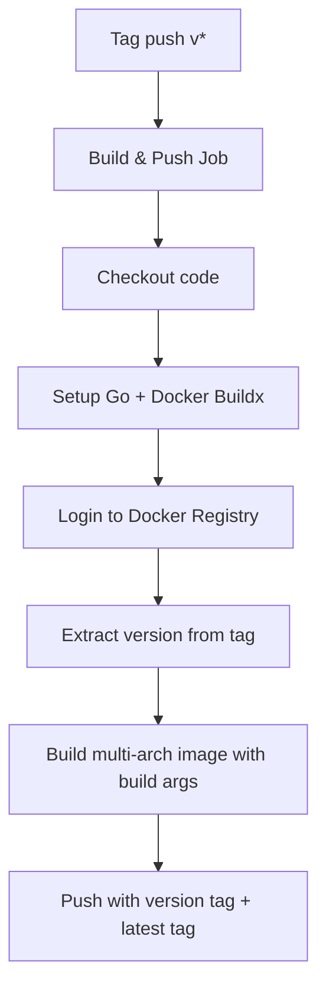

# Design Document: CI/CD Pipeline

## Overview

增强 wechat-subscription-svc 项目的 CI/CD 流程。CI 部分在现有 `.gitea/workflows/ci.yaml` 基础上增加 golangci-lint、Go module 缓存、Docker 构建验证和 govulncheck 安全扫描。CD 部分新建 `.gitea/workflows/cd.yaml`，基于 v* tag push 触发，自动构建多架构 Docker 镜像并推送到 Registry。

同时需要修改现有 `Dockerfile` 以支持多架构构建和构建参数注入，并新增版本信息包供 ldflags 注入。

## Architecture

### CI Pipeline 流程



### CD Pipeline 流程



### Job 依赖关系

CI Pipeline:
- `lint` → 无依赖，首先执行
- `security` → 依赖 `lint`
- `test` → 依赖 `lint`
- `build` → 依赖 `test`

CD Pipeline:
- `build-and-push` → 单一 job，tag push 触发

## Components and Interfaces

### 1. CI Workflow (`.gitea/workflows/ci.yaml`)

增强现有文件，保留原有结构，新增以下内容：

**Go Module 缓存**：通过 `actions/setup-go` 的内置缓存功能实现（设置 `cache: true`），无需额外的 cache action。该功能会自动缓存 `~/go/pkg/mod` 和 `~/.cache/go-build`，以 `go.sum` 文件哈希作为缓存 key。

**Lint Job 增强**：
- 保留现有 gofmt 和 go vet 检查
- 新增 golangci-lint step，使用 `golangci/golangci-lint-action` action
- golangci-lint 自动加载项目根目录的 `.golangci.yml`

**Security Job（新增）**：
- 安装并运行 `govulncheck`
- 与 lint 并行执行，不阻塞 test

**Build Job 增强**：
- 保留现有 Go binary 构建
- 新增 Docker 构建验证 step（`docker build` 不推送）

### 2. CD Workflow (`.gitea/workflows/cd.yaml`)

新建文件，包含：

**触发条件**：
```yaml
on:
  push:
    tags:
      - 'v*'
```

**Build & Push Job**：
- 使用 `docker/setup-buildx-action` 配置 buildx
- 使用 `docker/login-action` 登录 Registry（凭据从 secrets 读取）
- 使用 `docker/metadata-action` 提取 tag 信息生成镜像标签
- 使用 `docker/build-push-action` 构建多架构镜像并推送

**Secrets 依赖**：
- `DOCKER_REGISTRY`：Docker Registry 地址（如 `docker.io`）
- `DOCKER_USERNAME`：Registry 用户名
- `DOCKER_PASSWORD`：Registry 密码
- `DOCKER_NAMESPACE`：镜像命名空间（如 Docker Hub 用户名或组织名）

### 3. Dockerfile 修改

当前 Dockerfile 存在两个问题需要修改：

**问题 1**：构建阶段硬编码了 `GOARCH=amd64`，不支持多架构构建。
**修复**：移除硬编码的 `GOOS` 和 `GOARCH`，让 Docker buildx 通过 `--platform` 自动设置目标架构。

**问题 2**：没有 `ARG` 声明来接收构建参数。
**修复**：添加 `ARG VERSION`、`ARG BUILD_TIME`、`ARG GIT_COMMIT`，并在 `go build` 的 `-ldflags` 中注入这些值。

### 4. 版本信息包 (`internal/version/version.go`)

新增一个 `version` 包，声明可通过 ldflags 注入的变量：

```go
package version

var (
    Version   = "dev"
    BuildTime = "unknown"
    GitCommit = "unknown"
)
```

构建时通过 `-ldflags` 注入：
```
-ldflags="-w -s -X git.uhomes.net/uhs-go/wechat-subscription-svc/internal/version.Version=${VERSION} -X ...BuildTime=${BUILD_TIME} -X ...GitCommit=${GIT_COMMIT}"
```

## Data Models

### CI Workflow 配置结构

```yaml
# 环境变量
env:
  GO_VERSION: '1.25'

# Jobs
jobs:
  lint:        # gofmt + go vet + golangci-lint
  security:    # govulncheck (depends: lint)
  test:        # go test with redis (depends: lint)
  build:       # go build + docker build verify (depends: test)
```

### CD Workflow 配置结构

```yaml
# 触发条件
on:
  push:
    tags: ['v*']

# 环境变量
env:
  GO_VERSION: '1.25'
  IMAGE_NAME: 'wechat-subscription-svc'

# Jobs
jobs:
  build-and-push:  # buildx multi-arch build + push
```

### Docker 镜像标签策略

| 触发 Tag | 镜像标签 |
|----------|---------|
| `v26.2.9` | `namespace/wechat-subscription-svc:v26.2.9`, `namespace/wechat-subscription-svc:latest` |
| `v26.2.9.1` | `namespace/wechat-subscription-svc:v26.2.9.1`, `namespace/wechat-subscription-svc:latest` |

### Build Args 映射

| Build Arg | 值来源 | 示例 |
|-----------|--------|------|
| `VERSION` | Git tag (`github.ref_name`) | `v26.2.9` |
| `BUILD_TIME` | 构建时 UTC 时间 | `2026-02-09T10:30:00Z` |
| `GIT_COMMIT` | Git commit SHA (`github.sha`) | `abc1234...` |


## Correctness Properties

*A property is a characteristic or behavior that should hold true across all valid executions of a system — essentially, a formal statement about what the system should do. Properties serve as the bridge between human-readable specifications and machine-verifiable correctness guarantees.*

本项目的交付物主要是 YAML 工作流配置文件和 Dockerfile，而非运行时代码逻辑。大部分需求的正确性依赖于 CI/CD 运行时行为（工具退出码、缓存机制等），这些由 Gitea Actions 平台保证，无法在本地进行属性测试。

可测试的属性集中在 YAML 配置文件的结构正确性上：

### Property 1: Go jobs 缓存一致性

*For any* job in the CI workflow that uses `actions/setup-go`, that job's setup-go step SHALL have cache enabled (via `cache: true` or equivalent configuration).

**Validates: Requirements 2.1**

### 可验证的示例（非属性测试）

以下需求通过结构化检查验证，属于具体示例而非通用属性：

- **1.1**: CI YAML 包含 golangci-lint step 且引用 `.golangci.yml`
- **3.1 + 3.2**: CI YAML build job 包含 `docker build` step 且不含 `--push`
- **4.1**: CI YAML 包含 govulncheck step
- **5.1 + 5.3**: CD YAML 触发条件为 `push.tags: ['v*']` 且使用 `github.ref_name` 提取版本
- **6.1**: CD YAML 构建 step 指定 `platform: linux/amd64,linux/arm64`
- **6.2**: CD YAML 传递 build-args（VERSION, BUILD_TIME, GIT_COMMIT）且 Dockerfile 声明对应 ARG
- **7.1 + 7.2**: CD YAML 构建 step 设置 `push: true` 并生成 version tag 和 latest tag
- **7.4**: CD YAML 登录 step 使用 `secrets.*` 引用凭据

## Error Handling

### CI Pipeline 错误处理

| 场景 | 处理方式 |
|------|---------|
| golangci-lint 发现问题 | Job 失败，输出问题详情，阻止后续 job |
| govulncheck 发现漏洞 | Job 失败，输出漏洞详情 |
| 单元测试失败 | Job 失败，阻止 build job |
| 覆盖率低于阈值 | Job 失败，输出当前覆盖率 |
| Docker 构建验证失败 | Job 失败，输出构建错误 |
| Go module 缓存未命中 | 正常下载依赖，不影响流水线 |

### CD Pipeline 错误处理

| 场景 | 处理方式 |
|------|---------|
| Docker Registry 登录失败 | Job 失败，输出认证错误 |
| 多架构构建失败 | Job 失败，输出构建错误 |
| 镜像推送失败 | Job 失败，输出推送错误 |
| Secrets 未配置 | Job 失败，提示缺少必要的 secrets 配置 |

## Testing Strategy

### 测试方法

由于本功能的交付物是 CI/CD 配置文件（YAML）和 Dockerfile 修改，测试策略以结构验证和手动集成测试为主：

**结构验证（自动化）**：
- YAML 语法正确性验证
- 工作流配置结构检查（job 依赖关系、step 顺序）
- Dockerfile ARG 声明与 CD workflow build-args 一致性检查

**手动集成测试**：
- 推送 PR 验证 CI pipeline 完整执行
- 推送 v* tag 验证 CD pipeline 触发和镜像推送
- 验证多架构镜像可在 amd64 和 arm64 上拉取

### 属性测试

**Property 1** 可通过解析 CI YAML 文件并遍历所有 job 来验证。由于本项目已使用 Go 和 `gopter` 库，可编写一个简单的测试来解析 YAML 并验证缓存配置。但考虑到 CI YAML 文件结构相对固定（job 数量有限），此属性更适合作为 code review checklist 项而非自动化属性测试。

### 验证清单

- [ ] CI: golangci-lint 正确加载 .golangci.yml 并报告问题
- [ ] CI: Go module 缓存在第二次运行时命中
- [ ] CI: Docker 构建验证通过但不推送镜像
- [ ] CI: govulncheck 正常执行扫描
- [ ] CD: v* tag push 触发 CD pipeline
- [ ] CD: 非 v* tag 不触发 CD pipeline
- [ ] CD: 多架构镜像成功构建并推送
- [ ] CD: 镜像同时打上版本标签和 latest 标签
- [ ] CD: Build args 正确注入到镜像中
- [ ] Dockerfile: 多架构构建正常工作（移除硬编码 GOARCH）
