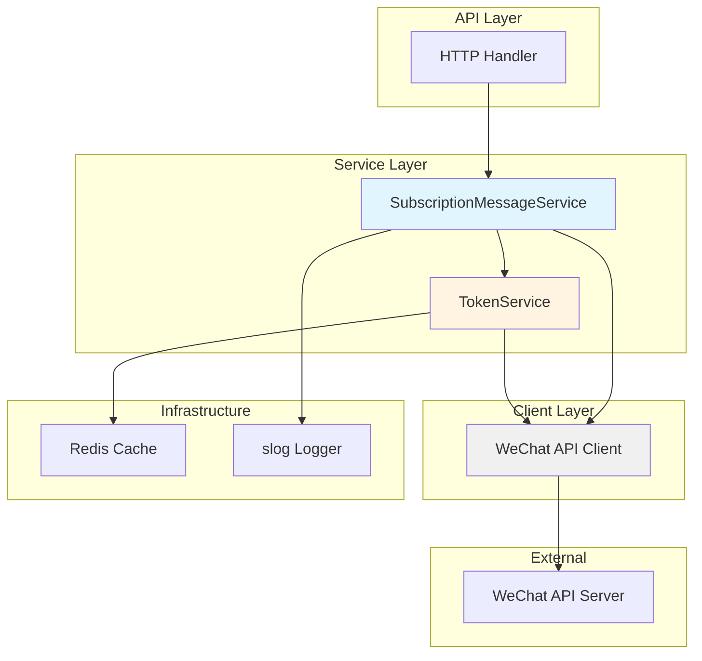
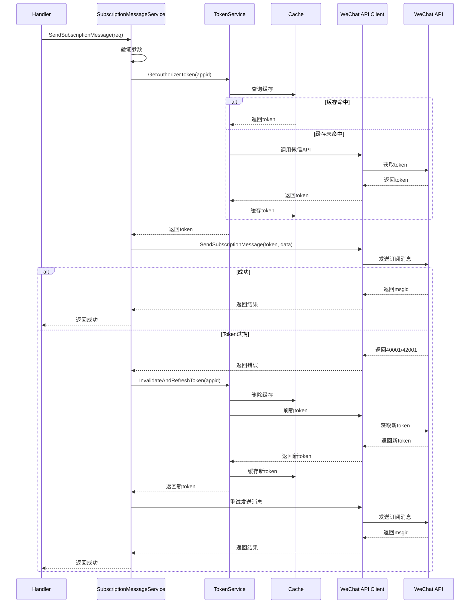

# 设计文档：微信小程序订阅消息功能

## 概述

本设计文档描述了微信小程序订阅消息功能的技术实现方案。该功能允许公众号向已订阅的用户发送订阅消息，并提供模板管理能力。

### 设计目标

- 提供可靠的订阅消息发送服务
- 实现自动令牌管理和刷新机制
- 确保与现有架构无缝集成
- 提供完整的错误处理和日志追踪
- 支持高并发场景

### 技术栈

- 语言：Go 1.25
- 依赖注入：uber-go/fx
- 日志：log/slog
- 缓存：Redis (go-redis/v9)
- 并发控制：golang.org/x/sync/singleflight
- HTTP客户端：net/http (复用连接池)

## 架构

### 系统架构图



### 架构分层

1. **Handler层**：接收HTTP请求，参数验证，调用Service层
2. **Service层**：业务逻辑处理，令牌管理，错误处理
3. **Client层**：封装微信API调用，重试机制
4. **Infrastructure层**：缓存、日志等基础设施

### 数据流



## 组件和接口

### WeChatCallbackHandler 接口（新增）

```go
// WeChatCallbackHandler 定义微信回调处理器接口
type WeChatCallbackHandler interface {
    // VerifyServer 验证微信服务器
    VerifyServer(ctx context.Context, req *ServerVerificationRequest) (*ServerVerificationResponse, error)
}
```

### 服务器验证请求和响应结构

#### ServerVerificationRequest

```go
type ServerVerificationRequest struct {
    Signature string `form:"signature" binding:"required"`
    Timestamp string `form:"timestamp" binding:"required"`
    Nonce     string `form:"nonce" binding:"required"`
    Echostr   string `form:"echostr" binding:"required"`
    // 可选：用于区分不同公众号
    AuthorizerAppID string `form:"authorizer_appid"`
}
```

#### ServerVerificationResponse

```go
type ServerVerificationResponse struct {
    Echostr string `json:"echostr,omitempty"`
    Valid   bool   `json:"valid"`
    Message string `json:"message,omitempty"`
}
```

### SubscriptionMessageService 接口

```go
// SubscriptionMessageService 定义订阅消息服务接口
type SubscriptionMessageService interface {
    // SendSubscriptionMessage 发送订阅消息
    SendSubscriptionMessage(ctx context.Context, req *SendSubscriptionMessageRequest) (*SendSubscriptionMessageResponse, error)
    
    // GetTemplateList 获取订阅消息模板列表
    GetTemplateList(ctx context.Context, req *GetTemplateListRequest) (*GetTemplateListResponse, error)
}
```

### 请求和响应结构

#### SendSubscriptionMessageRequest

```go
type SendSubscriptionMessageRequest struct {
    AuthorizerAppID string                 `json:"authorizer_app_id" validate:"required"`
    OpenID          string                 `json:"openid" validate:"required,len=28"`
    TemplateID      string                 `json:"template_id" validate:"required"`
    Data            map[string]interface{} `json:"data" validate:"required,max=20"`
    Page            string                 `json:"page,omitempty"`
    MiniprogramState string                `json:"miniprogram_state,omitempty"`
    Lang            string                 `json:"lang,omitempty"`
}
```

#### SendSubscriptionMessageResponse

```go
type SendSubscriptionMessageResponse struct {
    MsgID   int64  `json:"msgid,omitempty"`
    ErrCode int    `json:"errcode"`
    ErrMsg  string `json:"errmsg,omitempty"`
}
```

#### GetTemplateListRequest

```go
type GetTemplateListRequest struct {
    AuthorizerAppID string `json:"authorizer_app_id" validate:"required"`
}
```

#### GetTemplateListResponse

```go
type GetTemplateListResponse struct {
    Templates []SubscriptionTemplate `json:"data"`
    ErrCode   int                    `json:"errcode"`
    ErrMsg    string                 `json:"errmsg,omitempty"`
}

type SubscriptionTemplate struct {
    PriTmplID string `json:"priTmplId"`
    Title     string `json:"title"`
    Content   string `json:"content"`
    Example   string `json:"example"`
    Type      int    `json:"type"`
}
```

### WeChat API Client 扩展

需要在 `internal/wechat/client/client.go` 中添加以下方法：

```go
// SendSubscriptionMessage 发送订阅消息
func (c *HTTPClient) SendSubscriptionMessage(
    ctx context.Context, 
    accessToken string, 
    req *wechat.SendSubscriptionMessageRequest,
) (*wechat.SendSubscriptionMessageResponse, error)

// GetSubscriptionTemplateList 获取订阅消息模板列表
func (c *HTTPClient) GetSubscriptionTemplateList(
    ctx context.Context, 
    accessToken string,
) (*wechat.GetTemplateListResponse, error)
```

### 服务实现结构

```go
type SubscriptionMessageServiceImpl struct {
    tokenService TokenService
    wechatClient client.Client
    cacheRepo    cache.Repository
    logger       *slog.Logger
}

func NewSubscriptionMessageService(
    tokenService TokenService,
    wechatClient client.Client,
    cacheRepo cache.Repository,
    logger *slog.Logger,
) *SubscriptionMessageServiceImpl {
    return &SubscriptionMessageServiceImpl{
        tokenService: tokenService,
        wechatClient: wechatClient,
        cacheRepo:    cacheRepo,
        logger:       logger,
    }
}
```

## 数据模型

### 微信API数据模型

在 `internal/wechat/models.go` 中添加：

```go
// SendSubscriptionMessageRequest 发送订阅消息请求
type SendSubscriptionMessageRequest struct {
    ToUser           string                 `json:"touser"`
    TemplateID       string                 `json:"template_id"`
    Page             string                 `json:"page,omitempty"`
    Data             map[string]interface{} `json:"data"`
    MiniprogramState string                 `json:"miniprogram_state,omitempty"`
    Lang             string                 `json:"lang,omitempty"`
}

// SendSubscriptionMessageResponse 发送订阅消息响应
type SendSubscriptionMessageResponse struct {
    ErrCode int    `json:"errcode"`
    ErrMsg  string `json:"errmsg"`
    MsgID   int64  `json:"msgid,omitempty"`
}

// GetTemplateListResponse 获取模板列表响应
type GetTemplateListResponse struct {
    ErrCode int                      `json:"errcode"`
    ErrMsg  string                   `json:"errmsg"`
    Data    []SubscriptionTemplate   `json:"data"`
}

// SubscriptionTemplate 订阅消息模板
type SubscriptionTemplate struct {
    PriTmplID string `json:"priTmplId"`
    Title     string `json:"title"`
    Content   string `json:"content"`
    Example   string `json:"example"`
    Type      int    `json:"type"`
}
```

### 错误码常量

```go
const (
    // 订阅消息相关错误码
    ErrCodeSubscriptionExpired  = 43101 // 用户拒绝或订阅已过期
    ErrCodeTemplateNotFound     = 40037 // 模板ID不存在
    ErrCodeRateLimitExceeded    = 45009 // 频率限制
    ErrCodeInvalidOpenID        = 40003 // OpenID无效
    ErrCodeDataFieldTooLong     = 47003 // 数据字段值过长
)
```

### 缓存键格式

```go
// 模板列表缓存键格式
func FormatTemplateListKey(appID string) string {
    return fmt.Sprintf("wechat:template_list:%s", appID)
}
```

### 缓存策略

- **模板列表缓存**：30分钟过期
- **访问令牌缓存**：复用现有TokenService的缓存机制

## 核心算法和伪代码

### VerifyServer 实现（新增）

```go
func (h *WeChatCallbackHandlerImpl) VerifyServer(
    ctx context.Context,
    req *ServerVerificationRequest,
) (*ServerVerificationResponse, error) {
    ctx, requestID := EnsureRequestID(ctx)
    
    h.logger.Info("[VerifyServer] started",
        slog.String("request_id", requestID),
        slog.String("timestamp", req.Timestamp),
        slog.String("nonce", req.Nonce),
    )
    
    // 1. 获取配置的Token（可以根据authorizer_appid获取不同的token）
    token := h.getCallbackToken(req.AuthorizerAppID)
    if token == "" {
        h.logger.Error("[VerifyServer] token not configured",
            slog.String("request_id", requestID),
        )
        return &ServerVerificationResponse{
            Valid:   false,
            Message: "callback token not configured",
        }, fmt.Errorf("callback token not configured")
    }
    
    // 2. 计算签名
    // 将token、timestamp、nonce三个参数进行字典序排序
    params := []string{token, req.Timestamp, req.Nonce}
    sort.Strings(params)
    
    // 3. 拼接字符串并进行SHA1加密
    str := strings.Join(params, "")
    hash := sha1.New()
    hash.Write([]byte(str))
    calculatedSignature := hex.EncodeToString(hash.Sum(nil))
    
    // 4. 验证签名
    if calculatedSignature != req.Signature {
        h.logger.Warn("[VerifyServer] signature mismatch",
            slog.String("request_id", requestID),
            slog.String("expected", calculatedSignature),
            slog.String("received", req.Signature),
        )
        return &ServerVerificationResponse{
            Valid:   false,
            Message: "signature verification failed",
        }, nil
    }
    
    // 5. 签名验证成功，返回echostr
    h.logger.Info("[VerifyServer] verification success",
        slog.String("request_id", requestID),
    )
    
    return &ServerVerificationResponse{
        Echostr: req.Echostr,
        Valid:   true,
    }, nil
}

// getCallbackToken 获取回调Token（可以根据appid从配置中获取）
func (h *WeChatCallbackHandlerImpl) getCallbackToken(appID string) string {
    // 如果配置了多个公众号，可以根据appID返回不同的token
    // 这里简化处理，返回统一配置的token
    return h.config.WeChat.CallbackToken
}
```

### SendSubscriptionMessage 实现

```go
func (s *SubscriptionMessageServiceImpl) SendSubscriptionMessage(
    ctx context.Context, 
    req *SendSubscriptionMessageRequest,
) (*SendSubscriptionMessageResponse, error) {
    // 1. 确保请求ID存在
    ctx, requestID := EnsureRequestID(ctx)
    serviceStart := time.Now()
    
    s.logger.Info("[SendSubscriptionMessage] started",
        slog.String("request_id", requestID),
        slog.String("appid", req.AuthorizerAppID),
        slog.String("openid", req.OpenID),
        slog.String("template_id", req.TemplateID),
    )
    
    // 2. 参数验证
    if err := s.validateRequest(req); err != nil {
        s.logger.Error("[SendSubscriptionMessage] validation failed",
            slog.String("request_id", requestID),
            slog.String("error", err.Error()),
        )
        return nil, fmt.Errorf("validation failed: %w", err)
    }
    
    // 3. 获取访问令牌
    tokenStart := time.Now()
    token, err := s.tokenService.GetAuthorizerToken(ctx, req.AuthorizerAppID)
    tokenDuration := time.Since(tokenStart)
    
    if err != nil {
        s.logger.Error("[SendSubscriptionMessage] failed to get token",
            slog.String("request_id", requestID),
            slog.Duration("token_duration", tokenDuration),
            slog.String("error", err.Error()),
        )
        return nil, fmt.Errorf("failed to get token: %w", err)
    }
    
    // 4. 构造微信API请求
    wechatReq := &wechat.SendSubscriptionMessageRequest{
        ToUser:           req.OpenID,
        TemplateID:       req.TemplateID,
        Page:             req.Page,
        Data:             req.Data,
        MiniprogramState: req.MiniprogramState,
        Lang:             req.Lang,
    }
    
    // 5. 调用微信API
    apiStart := time.Now()
    resp, err := s.wechatClient.SendSubscriptionMessage(ctx, token, wechatReq)
    apiDuration := time.Since(apiStart)
    
    // 6. 处理令牌过期错误（自动重试）
    if err != nil && isTokenExpiredError(err) {
        s.logger.Warn("[SendSubscriptionMessage] token expired, retrying",
            slog.String("request_id", requestID),
            slog.Duration("api_duration", apiDuration),
        )
        
        // 刷新令牌
        refreshStart := time.Now()
        token, err = s.tokenService.InvalidateAndRefreshToken(ctx, req.AuthorizerAppID)
        refreshDuration := time.Since(refreshStart)
        
        if err != nil {
            s.logger.Error("[SendSubscriptionMessage] token refresh failed",
                slog.String("request_id", requestID),
                slog.Duration("refresh_duration", refreshDuration),
                slog.String("error", err.Error()),
            )
            return nil, fmt.Errorf("failed to refresh token: %w", err)
        }
        
        // 重试API调用
        retryStart := time.Now()
        resp, err = s.wechatClient.SendSubscriptionMessage(ctx, token, wechatReq)
        apiDuration = time.Since(retryStart)
    }
    
    // 7. 处理最终结果
    totalDuration := time.Since(serviceStart)
    
    if err != nil {
        s.logger.Error("[SendSubscriptionMessage] failed",
            slog.String("request_id", requestID),
            slog.Duration("api_duration", apiDuration),
            slog.Duration("total_duration", totalDuration),
            slog.String("error", err.Error()),
        )
        return nil, fmt.Errorf("failed to send message: %w", err)
    }
    
    s.logger.Info("[SendSubscriptionMessage] completed",
        slog.String("request_id", requestID),
        slog.Int64("msgid", resp.MsgID),
        slog.Duration("token_duration", tokenDuration),
        slog.Duration("api_duration", apiDuration),
        slog.Duration("total_duration", totalDuration),
    )
    
    return &SendSubscriptionMessageResponse{
        MsgID:   resp.MsgID,
        ErrCode: resp.ErrCode,
        ErrMsg:  resp.ErrMsg,
    }, nil
}
```

### GetTemplateList 实现

```go
func (s *SubscriptionMessageServiceImpl) GetTemplateList(
    ctx context.Context, 
    req *GetTemplateListRequest,
) (*GetTemplateListResponse, error) {
    ctx, requestID := EnsureRequestID(ctx)
    serviceStart := time.Now()
    
    s.logger.Info("[GetTemplateList] started",
        slog.String("request_id", requestID),
        slog.String("appid", req.AuthorizerAppID),
    )
    
    // 1. 检查缓存
    cacheKey := cache.FormatTemplateListKey(req.AuthorizerAppID)
    cacheStart := time.Now()
    
    var cachedTemplates []SubscriptionTemplate
    err := s.cacheRepo.Get(ctx, cacheKey, &cachedTemplates)
    cacheDuration := time.Since(cacheStart)
    
    if err == nil && len(cachedTemplates) > 0 {
        s.logger.Debug("[GetTemplateList] cache hit",
            slog.String("request_id", requestID),
            slog.Duration("cache_duration", cacheDuration),
            slog.Int("template_count", len(cachedTemplates)),
        )
        
        return &GetTemplateListResponse{
            Templates: cachedTemplates,
            ErrCode:   0,
        }, nil
    }
    
    // 2. 获取访问令牌
    tokenStart := time.Now()
    token, err := s.tokenService.GetAuthorizerToken(ctx, req.AuthorizerAppID)
    tokenDuration := time.Since(tokenStart)
    
    if err != nil {
        s.logger.Error("[GetTemplateList] failed to get token",
            slog.String("request_id", requestID),
            slog.Duration("token_duration", tokenDuration),
            slog.String("error", err.Error()),
        )
        return nil, fmt.Errorf("failed to get token: %w", err)
    }
    
    // 3. 调用微信API
    apiStart := time.Now()
    resp, err := s.wechatClient.GetSubscriptionTemplateList(ctx, token)
    apiDuration := time.Since(apiStart)
    
    // 4. 处理令牌过期（重试）
    if err != nil && isTokenExpiredError(err) {
        s.logger.Warn("[GetTemplateList] token expired, retrying",
            slog.String("request_id", requestID),
        )
        
        token, err = s.tokenService.InvalidateAndRefreshToken(ctx, req.AuthorizerAppID)
        if err != nil {
            return nil, fmt.Errorf("failed to refresh token: %w", err)
        }
        
        resp, err = s.wechatClient.GetSubscriptionTemplateList(ctx, token)
    }
    
    if err != nil {
        s.logger.Error("[GetTemplateList] failed",
            slog.String("request_id", requestID),
            slog.Duration("total_duration", time.Since(serviceStart)),
            slog.String("error", err.Error()),
        )
        return nil, fmt.Errorf("failed to get template list: %w", err)
    }
    
    // 5. 缓存结果（30分钟）
    if len(resp.Data) > 0 {
        cacheErr := s.cacheRepo.Set(ctx, cacheKey, resp.Data, 30*time.Minute)
        if cacheErr != nil {
            s.logger.Warn("[GetTemplateList] cache write failed",
                slog.String("request_id", requestID),
                slog.String("error", cacheErr.Error()),
            )
        }
    }
    
    s.logger.Info("[GetTemplateList] completed",
        slog.String("request_id", requestID),
        slog.Int("template_count", len(resp.Data)),
        slog.Duration("total_duration", time.Since(serviceStart)),
    )
    
    return &GetTemplateListResponse{
        Templates: resp.Data,
        ErrCode:   resp.ErrCode,
        ErrMsg:    resp.ErrMsg,
    }, nil
}
```

### 参数验证函数

```go
func (s *SubscriptionMessageServiceImpl) validateRequest(req *SendSubscriptionMessageRequest) error {
    // 验证OpenID长度
    if len(req.OpenID) != 28 {
        return fmt.Errorf("invalid openid length: expected 28, got %d", len(req.OpenID))
    }
    
    // 验证Data字段数量
    if len(req.Data) > 20 {
        return fmt.Errorf("data fields exceed limit: max 20, got %d", len(req.Data))
    }
    
    // 验证Data字段类型和长度
    for key, value := range req.Data {
        // 检查键是否为字符串
        if _, ok := key.(string); !ok {
            return fmt.Errorf("data key must be string: %v", key)
        }
        
        // 检查值的类型和长度
        switch v := value.(type) {
        case map[string]interface{}:
            // 订阅消息的data字段格式：{"value": "xxx"}
            if val, ok := v["value"].(string); ok {
                if len(val) > 20 {
                    return fmt.Errorf("data field '%s' value too long: max 20, got %d", key, len(val))
                }
            } else {
                return fmt.Errorf("data field '%s' must have 'value' as string", key)
            }
        default:
            return fmt.Errorf("data field '%s' must be object with 'value' key", key)
        }
    }
    
    // 验证page参数格式（如果提供）
    if req.Page != "" {
        // 小程序页面路径格式：pages/xxx/xxx
        if !strings.HasPrefix(req.Page, "pages/") {
            return fmt.Errorf("invalid page path format: must start with 'pages/'")
        }
    }
    
    return nil
}
```

### 错误判断辅助函数

```go
// isTokenExpiredError 判断是否为令牌过期错误
func isTokenExpiredError(err error) bool {
    if err == nil {
        return false
    }
    errMsg := err.Error()
    return strings.Contains(errMsg, "code=40001") ||
           strings.Contains(errMsg, "code=42001")
}

// isSubscriptionExpiredError 判断是否为订阅过期错误
func isSubscriptionExpiredError(err error) bool {
    if err == nil {
        return false
    }
    return strings.Contains(err.Error(), "code=43101")
}

// isRateLimitError 判断是否为频率限制错误
func isRateLimitError(err error) bool {
    if err == nil {
        return false
    }
    return strings.Contains(err.Error(), "code=45009")
}
```


## 正确性属性

*属性是一个特征或行为，应该在系统的所有有效执行中保持为真——本质上是关于系统应该做什么的形式化陈述。属性作为人类可读规范和机器可验证正确性保证之间的桥梁。*

### 属性 1: 参数验证先行

*对于任何* 发送订阅消息的请求，如果参数验证失败（OpenID长度不是28字符、data字段超过20个、data值超过20字符、必需参数为空、page路径格式无效），则服务应该立即返回验证错误，而不调用微信API。

**验证需求: 1.2, 1.3, 1.4, 4.3, 4.4, 4.5, 7.1, 7.2, 7.3, 7.4, 7.5**

### 属性 2: 令牌过期自动恢复（Round Trip）

*对于任何* 发送请求，当微信API返回令牌过期错误（错误码40001或42001）时，服务应该自动刷新令牌并重试一次，最终返回成功或非令牌错误。

**验证需求: 1.7, 3.1, 3.6**

### 属性 3: 成功响应包含消息ID（Invariant）

*对于任何* 成功发送的订阅消息，响应中必须包含非零的msgid字段。

**验证需求: 1.5**

### 属性 4: 错误响应包含错误信息（Invariant）

*对于任何* 失败的发送请求，响应中必须包含非零的errcode和非空的errmsg字段。

**验证需求: 1.6**

### 属性 5: 模板列表缓存一致性（Metamorphic）

*对于任何* authorizer_app_id，在缓存有效期内（30分钟）的多次GetTemplateList调用应该返回相同的结果，且只触发一次微信API调用。

**验证需求: 2.5, 2.6**

### 属性 6: 空模板列表处理（Edge Case）

*对于任何* 没有订阅消息模板的小程序，GetTemplateList应该返回空列表（长度为0），而不是返回错误。

**验证需求: 2.4**

### 属性 7: 特定错误码映射正确性（Invariant）

*对于任何* 微信API返回的错误码，服务应该正确映射：
- 45009 → 频率限制错误
- 43101 → 订阅状态错误
- 40037 → 模板不存在错误
- 40001/42001 → 触发令牌刷新和重试

**验证需求: 3.2, 3.3, 3.4**

### 属性 8: 日志完整性（Invariant）

*对于任何* 服务操作（SendSubscriptionMessage或GetTemplateList），日志中必须包含：
- 唯一的request_id
- 操作开始和完成的日志条目
- 令牌获取耗时（token_duration）
- API调用耗时（api_duration）
- 总操作耗时（total_duration）
- 成功时为INFO级别，失败时为ERROR级别

**验证需求: 1.9, 3.7, 5.1, 5.2, 5.3, 5.4, 5.5, 5.6, 5.7, 6.6**

### 属性 9: 依赖服务正确使用（Invariant）

*对于任何* 需要访问令牌的操作，服务必须通过TokenService获取令牌，并通过WeChatClient调用微信API，而不是直接调用。

**验证需求: 6.1, 6.2**

### 属性 10: 并发令牌刷新幂等性（Confluence）

*对于任何* authorizer_app_id，多个并发的令牌刷新请求应该只触发一次实际的微信API调用（通过singleflight保证），且所有请求都应该获得有效的令牌。

**验证需求: 8.2**

### 属性 11: 并发请求独立性（Confluence）

*对于任何* 两个不同的发送请求（不同的openid或template_id），并发执行时应该互不影响，都能正确完成或失败。

**验证需求: 8.1**

## 错误处理

### 错误分类

#### 1. 客户端错误（4xxxx）

这类错误由客户端参数问题引起，不应重试：

- **40001/42001**: 令牌无效或过期 → 自动刷新令牌并重试一次
- **40003**: OpenID无效 → 返回参数错误
- **40037**: 模板ID不存在 → 返回模板不存在错误
- **43101**: 用户拒绝或订阅过期 → 返回订阅状态错误
- **47003**: 数据字段值过长 → 返回参数错误

#### 2. 服务端错误（5xxxx）

这类错误由微信服务器问题引起：

- **45009**: 频率限制 → 返回频率限制错误，建议稍后重试
- **-1**: 系统繁忙 → 可以考虑重试

#### 3. 网络错误

- **超时**: 30秒超时 → 返回超时错误
- **连接失败**: 返回网络错误

### 错误处理策略

```go
func (s *SubscriptionMessageServiceImpl) handleError(err error, operation string) error {
    if err == nil {
        return nil
    }
    
    errMsg := err.Error()
    
    // 令牌过期错误 - 已在调用层处理重试
    if strings.Contains(errMsg, "code=40001") || strings.Contains(errMsg, "code=42001") {
        return fmt.Errorf("token expired: %w", err)
    }
    
    // 订阅状态错误
    if strings.Contains(errMsg, "code=43101") {
        return fmt.Errorf("subscription expired or rejected: %w", err)
    }
    
    // 模板不存在
    if strings.Contains(errMsg, "code=40037") {
        return fmt.Errorf("template not found: %w", err)
    }
    
    // 频率限制
    if strings.Contains(errMsg, "code=45009") {
        return fmt.Errorf("rate limit exceeded: %w", err)
    }
    
    // OpenID无效
    if strings.Contains(errMsg, "code=40003") {
        return fmt.Errorf("invalid openid: %w", err)
    }
    
    // 数据字段过长
    if strings.Contains(errMsg, "code=47003") {
        return fmt.Errorf("data field too long: %w", err)
    }
    
    // 其他错误
    return fmt.Errorf("%s failed: %w", operation, err)
}
```

### 重试策略

只有令牌过期错误（40001, 42001）会触发自动重试：

1. 检测到令牌过期错误
2. 调用 `TokenService.InvalidateAndRefreshToken()` 刷新令牌
3. 使用新令牌重试一次
4. 如果重试仍然失败，返回错误（不再重试）

其他所有错误都直接返回，不进行重试。

### 超时控制

```go
// 在HTTP客户端层设置超时
const (
    DefaultTimeout = 30 * time.Second  // 单次API调用超时
)

// 在context中传递超时
ctx, cancel := context.WithTimeout(ctx, 30*time.Second)
defer cancel()
```

## 测试策略

### 双重测试方法

本功能采用单元测试和基于属性的测试相结合的方法：

- **单元测试**: 验证特定示例、边界情况和错误条件
- **基于属性的测试**: 验证所有输入的通用属性

两者互补，共同确保全面覆盖（单元测试捕获具体错误，属性测试验证通用正确性）。

### 单元测试

单元测试应该关注：

1. **具体示例**
   - 成功发送订阅消息的完整流程
   - 成功获取模板列表的完整流程
   - 空模板列表的处理

2. **边界情况**
   - OpenID正好28字符
   - data字段正好20个
   - data值正好20字符
   - 空模板列表

3. **错误条件**
   - 各种参数验证失败场景
   - 特定错误码的处理（43101, 40037, 45009等）
   - 网络超时
   - 令牌刷新失败

4. **集成点**
   - 与TokenService的交互
   - 与WeChatClient的交互
   - 缓存的读写

### 基于属性的测试

使用 **gopter** 库进行基于属性的测试：

```go
import (
    "github.com/leanovate/gopter"
    "github.com/leanovate/gopter/gen"
    "github.com/leanovate/gopter/prop"
)
```

每个属性测试应该：
- 运行至少100次迭代
- 使用注释标记对应的设计属性
- 生成随机但有效的测试数据

#### 属性测试示例

```go
// Feature: subscription-message, Property 1: 参数验证先行
func TestProperty_ParameterValidationFirst(t *testing.T) {
    properties := gopter.NewProperties(nil)
    
    properties.Property("invalid parameters should fail before API call", 
        prop.ForAll(
            func(openIDLen int, dataFieldCount int, dataValueLen int) bool {
                // 生成无效参数
                req := generateInvalidRequest(openIDLen, dataFieldCount, dataValueLen)
                
                // 创建mock服务（API不应被调用）
                mockClient := &MockWeChatClient{callCount: 0}
                service := NewSubscriptionMessageService(mockTokenService, mockClient, mockCache, logger)
                
                // 调用服务
                _, err := service.SendSubscriptionMessage(context.Background(), req)
                
                // 验证：应该返回错误，且API未被调用
                return err != nil && mockClient.callCount == 0
            },
            gen.IntRange(0, 50).SuchThat(func(v int) bool { return v != 28 }), // OpenID长度不是28
            gen.IntRange(21, 50),  // data字段超过20个
            gen.IntRange(21, 100), // data值超过20字符
        ),
    )
    
    properties.TestingRun(t, gopter.ConsoleReporter(false))
}

// Feature: subscription-message, Property 2: 令牌过期自动恢复
func TestProperty_TokenExpiryAutoRecovery(t *testing.T) {
    properties := gopter.NewProperties(nil)
    
    properties.Property("token expiry should trigger refresh and retry",
        prop.ForAll(
            func(req *SendSubscriptionMessageRequest) bool {
                // 创建mock服务，第一次返回令牌过期，第二次成功
                mockClient := &MockWeChatClient{
                    responses: []mockResponse{
                        {err: fmt.Errorf("code=40001")},
                        {result: &wechat.SendSubscriptionMessageResponse{MsgID: 12345}},
                    },
                }
                mockTokenService := &MockTokenService{refreshCalled: false}
                
                service := NewSubscriptionMessageService(mockTokenService, mockClient, mockCache, logger)
                
                // 调用服务
                resp, err := service.SendSubscriptionMessage(context.Background(), req)
                
                // 验证：应该成功，且令牌刷新被调用
                return err == nil && resp.MsgID > 0 && mockTokenService.refreshCalled
            },
            genValidSendRequest(),
        ),
    )
    
    properties.TestingRun(t, gopter.ConsoleReporter(false))
}

// Feature: subscription-message, Property 5: 模板列表缓存一致性
func TestProperty_TemplateListCacheConsistency(t *testing.T) {
    properties := gopter.NewProperties(nil)
    
    properties.Property("cached template list should be consistent",
        prop.ForAll(
            func(appID string) bool {
                mockClient := &MockWeChatClient{callCount: 0}
                cache := NewMockCache()
                service := NewSubscriptionMessageService(mockTokenService, mockClient, cache, logger)
                
                req := &GetTemplateListRequest{AuthorizerAppID: appID}
                
                // 第一次调用
                resp1, err1 := service.GetTemplateList(context.Background(), req)
                
                // 第二次调用（应该从缓存返回）
                resp2, err2 := service.GetTemplateList(context.Background(), req)
                
                // 验证：两次结果相同，且API只被调用一次
                return err1 == nil && err2 == nil &&
                       reflect.DeepEqual(resp1, resp2) &&
                       mockClient.callCount == 1
            },
            gen.Identifier(),
        ),
    )
    
    properties.TestingRun(t, gopter.ConsoleReporter(false))
}

// Feature: subscription-message, Property 11: 并发请求独立性
func TestProperty_ConcurrentRequestIndependence(t *testing.T) {
    properties := gopter.NewProperties(nil)
    
    properties.Property("concurrent requests should not interfere",
        prop.ForAll(
            func(req1, req2 *SendSubscriptionMessageRequest) bool {
                service := NewSubscriptionMessageService(tokenService, wechatClient, cache, logger)
                
                var wg sync.WaitGroup
                var resp1, resp2 *SendSubscriptionMessageResponse
                var err1, err2 error
                
                // 并发执行两个请求
                wg.Add(2)
                go func() {
                    defer wg.Done()
                    resp1, err1 = service.SendSubscriptionMessage(context.Background(), req1)
                }()
                go func() {
                    defer wg.Done()
                    resp2, err2 = service.SendSubscriptionMessage(context.Background(), req2)
                }()
                wg.Wait()
                
                // 验证：两个请求都应该正确完成（成功或失败）
                return (err1 == nil || err1 != nil) && (err2 == nil || err2 != nil)
            },
            genValidSendRequest(),
            genValidSendRequest(),
        ),
    )
    
    properties.TestingRun(t, gopter.ConsoleReporter(false))
}
```

### 测试数据生成器

```go
// 生成有效的发送请求
func genValidSendRequest() gopter.Gen {
    return gopter.CombineGens(
        gen.Identifier(),                    // appID
        gen.RegexMatch("[a-zA-Z0-9]{28}"),  // openID (28字符)
        gen.Identifier(),                    // templateID
        genValidData(),                      // data
        gen.PtrOf(gen.RegexMatch("pages/[a-z]+/[a-z]+")), // page (可选)
    ).Map(func(values []interface{}) *SendSubscriptionMessageRequest {
        return &SendSubscriptionMessageRequest{
            AuthorizerAppID: values[0].(string),
            OpenID:          values[1].(string),
            TemplateID:      values[2].(string),
            Data:            values[3].(map[string]interface{}),
            Page:            values[4].(*string),
        }
    })
}

// 生成有效的data字段
func genValidData() gopter.Gen {
    return gen.MapOf(
        gen.Identifier(),  // key
        gen.StructPtr(
            gen.RegexMatch("[a-zA-Z0-9]{1,20}"),  // value (1-20字符)
        ).Map(func(v string) map[string]interface{} {
            return map[string]interface{}{"value": v}
        }),
    ).SuchThat(func(m map[string]interface{}) bool {
        return len(m) > 0 && len(m) <= 20  // 1-20个字段
    })
}
```

### 测试覆盖率目标

- 代码覆盖率：> 80%
- 分支覆盖率：> 75%
- 所有正确性属性都有对应的属性测试
- 所有错误码都有对应的单元测试

### Mock和测试工具

```go
// MockWeChatClient 用于测试
type MockWeChatClient struct {
    callCount int
    responses []mockResponse
    mu        sync.Mutex
}

type mockResponse struct {
    result interface{}
    err    error
}

func (m *MockWeChatClient) SendSubscriptionMessage(
    ctx context.Context,
    token string,
    req *wechat.SendSubscriptionMessageRequest,
) (*wechat.SendSubscriptionMessageResponse, error) {
    m.mu.Lock()
    defer m.mu.Unlock()
    
    if m.callCount < len(m.responses) {
        resp := m.responses[m.callCount]
        m.callCount++
        if resp.err != nil {
            return nil, resp.err
        }
        return resp.result.(*wechat.SendSubscriptionMessageResponse), nil
    }
    
    m.callCount++
    return &wechat.SendSubscriptionMessageResponse{MsgID: 12345}, nil
}

// MockTokenService 用于测试
type MockTokenService struct {
    token         string
    refreshCalled bool
    mu            sync.Mutex
}

func (m *MockTokenService) GetAuthorizerToken(ctx context.Context, appID string) (string, error) {
    m.mu.Lock()
    defer m.mu.Unlock()
    
    if m.token == "" {
        return "mock_token_123", nil
    }
    return m.token, nil
}

func (m *MockTokenService) InvalidateAndRefreshToken(ctx context.Context, appID string) (string, error) {
    m.mu.Lock()
    defer m.mu.Unlock()
    
    m.refreshCalled = true
    m.token = "new_mock_token_456"
    return m.token, nil
}
```

## 部署和集成

### 依赖注入配置

在 `internal/fx/modules.go` 中添加：

```go
var SubscriptionMessageModule = fx.Module("subscription_message",
    fx.Provide(
        service.NewSubscriptionMessageService,
    ),
)
```

在 `cmd/server/main.go` 中注册模块：

```go
fx.New(
    // ... 其他模块
    fx.SubscriptionMessageModule,
    // ...
)
```

### HTTP Handler注册

在 `internal/handler/` 中创建 `subscription_message_handler.go`：

```go
type SubscriptionMessageHandler struct {
    service service.SubscriptionMessageService
    logger  *slog.Logger
}

func NewSubscriptionMessageHandler(
    service service.SubscriptionMessageService,
    logger *slog.Logger,
) *SubscriptionMessageHandler {
    return &SubscriptionMessageHandler{
        service: service,
        logger:  logger,
    }
}

func (h *SubscriptionMessageHandler) RegisterRoutes(router *gin.Engine) {
    v1 := router.Group("/api/v1")
    {
        v1.POST("/subscription-message/send", h.SendSubscriptionMessage)
        v1.GET("/subscription-message/templates", h.GetTemplateList)
    }
}
```

### 配置文件

不需要额外的配置，复用现有的微信配置：

```yaml
wechat:
  component:
    app_id: "wx1234567890"
    app_secret: "secret123"
    verify_ticket: "ticket123"
  authorizers:
    - app_id: "wx0987654321"
      refresh_token: "refresh_token_123"
```

### 监控指标

建议添加以下Prometheus指标：

```go
var (
    subscriptionMessageSent = prometheus.NewCounterVec(
        prometheus.CounterOpts{
            Name: "subscription_message_sent_total",
            Help: "Total number of subscription messages sent",
        },
        []string{"appid", "status"},
    )
    
    subscriptionMessageDuration = prometheus.NewHistogramVec(
        prometheus.HistogramOpts{
            Name: "subscription_message_duration_seconds",
            Help: "Duration of subscription message operations",
            Buckets: prometheus.DefBuckets,
        },
        []string{"operation", "appid"},
    )
    
    templateListCacheHits = prometheus.NewCounterVec(
        prometheus.CounterOpts{
            Name: "template_list_cache_hits_total",
            Help: "Total number of template list cache hits",
        },
        []string{"appid"},
    )
)
```

## 性能考虑

### 缓存策略

1. **模板列表缓存**: 30分钟，减少API调用
2. **访问令牌缓存**: 复用TokenService的缓存（约2小时）
3. **缓存键设计**: 使用appID作为键的一部分，确保多租户隔离

### 连接池

HTTP客户端使用连接池：

```go
&http.Client{
    Timeout: 30 * time.Second,
    Transport: &http.Transport{
        MaxIdleConns:        100,
        MaxIdleConnsPerHost: 10,
        IdleConnTimeout:     90 * time.Second,
    },
}
```

### 并发控制

- 使用singleflight防止令牌刷新的惊群效应
- 服务本身是无状态的，支持水平扩展
- 使用Redis作为共享缓存，确保多实例一致性

### 性能目标

- 单次消息发送（缓存命中）：< 2秒
- 模板列表查询（缓存命中）：< 100毫秒
- 支持并发：至少100 QPS
- 令牌刷新不阻塞其他请求（通过singleflight）

## 安全考虑

### 参数验证

所有输入参数都经过严格验证：
- OpenID长度和格式
- 模板ID非空
- Data字段数量和长度限制
- Page路径格式

### 敏感信息保护

- 访问令牌不记录在日志中
- OpenID在日志中可以考虑脱敏（前4后4）
- 错误信息不暴露内部实现细节

### 频率限制

- 依赖微信API的频率限制
- 可以在应用层添加额外的频率限制（使用Redis）
- 返回明确的频率限制错误，避免重试风暴

## 维护和运维

### 日志查询

使用request_id追踪完整的请求链路：

```bash
# 查询特定请求的所有日志
grep "request_id=xxx" app.log

# 查询失败的发送操作
grep "SendSubscriptionMessage.*failed" app.log

# 查询令牌刷新操作
grep "token refreshed" app.log
```

### 常见问题排查

1. **消息发送失败**
   - 检查OpenID是否有效（28字符）
   - 检查用户是否已订阅
   - 检查模板ID是否存在
   - 检查是否触发频率限制

2. **令牌刷新频繁**
   - 检查缓存是否正常工作
   - 检查Redis连接
   - 检查令牌过期时间配置

3. **性能问题**
   - 检查缓存命中率
   - 检查微信API响应时间
   - 检查并发请求数量

### 告警规则

建议配置以下告警：

```yaml
- alert: SubscriptionMessageHighFailureRate
  expr: rate(subscription_message_sent_total{status="failed"}[5m]) > 0.1
  annotations:
    summary: "订阅消息发送失败率过高"

- alert: SubscriptionMessageSlowResponse
  expr: histogram_quantile(0.95, subscription_message_duration_seconds) > 5
  annotations:
    summary: "订阅消息发送响应时间过长"

- alert: TemplateListCacheLowHitRate
  expr: rate(template_list_cache_hits_total[5m]) < 0.8
  annotations:
    summary: "模板列表缓存命中率过低"
```

## 未来扩展

### 可能的增强功能

1. **批量发送**: 支持一次发送多条消息
2. **发送队列**: 使用消息队列异步发送，提高吞吐量
3. **发送历史**: 记录发送历史，支持查询和统计
4. **模板管理**: 支持添加、删除模板
5. **用户订阅管理**: 跟踪用户订阅状态

### 架构演进

当前设计支持以下演进路径：

1. **微服务拆分**: 可以独立部署为订阅消息微服务
2. **事件驱动**: 可以改造为事件驱动架构，通过消息队列触发发送
3. **多云部署**: 无状态设计支持跨云部署
4. **灰度发布**: 支持按appID进行灰度发布

## 参考资料

- [微信小程序订阅消息API文档](https://developers.weixin.qq.com/miniprogram/dev/api-backend/open-api/subscribe-message/subscribeMessage.send.html)
- [微信小程序前端订阅API](https://developers.weixin.qq.com/miniprogram/dev/api/open-api/subscribe-message/wx.requestSubscribeMessage.html)
- [Go并发模式: singleflight](https://pkg.go.dev/golang.org/x/sync/singleflight)
- [基于属性的测试: gopter](https://github.com/leanovate/gopter)
- 项目现有服务参考:
  - `internal/service/article_service.go`
  - `internal/service/token_service.go`
  - `internal/wechat/client/client.go`
