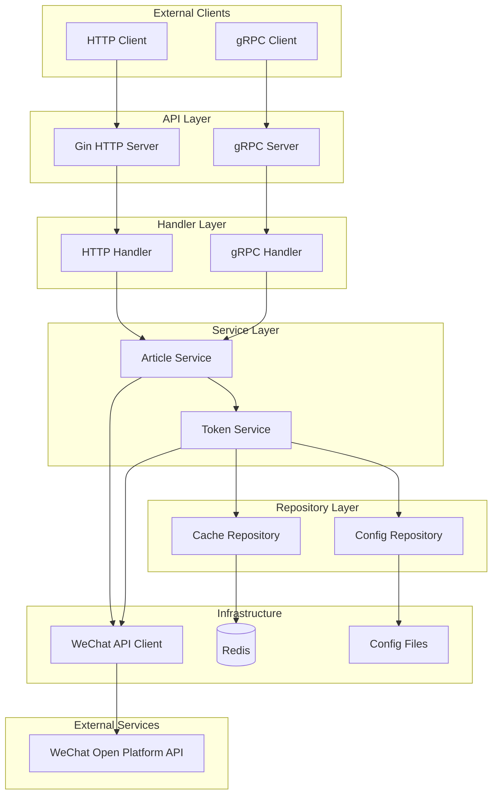
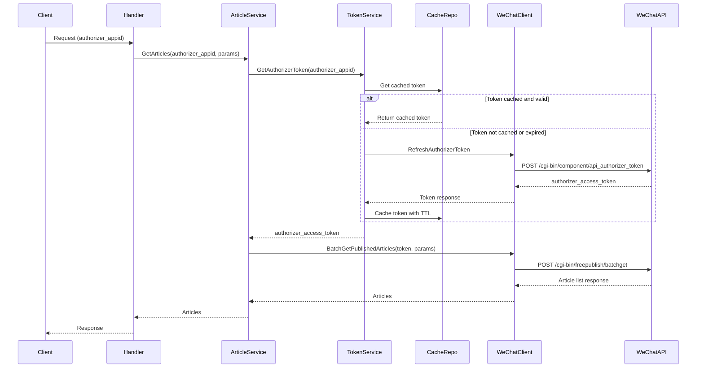

# Design Document: WeChat Subscription Service

## Overview

微信公众号订阅微服务是一个基于 Go 语言的微服务，负责管理微信第三方平台的 Token 并提供公众号图文消息的查询功能。服务采用分层架构，通过 Uber FX 进行依赖注入，同时提供 gRPC 和 HTTP REST API 两种接口。

### 核心设计目标

1. **多公众号支持**: 通过配置文件管理多个公众号的授权信息，Token 缓存使用 authorizer_appid 区分
2. **Token 自动管理**: 自动获取、缓存和刷新 Token，对调用方透明
3. **高可用性**: 使用 singleflight 防止并发刷新，支持重试机制
4. **可扩展性**: 预留数据库存储接口，便于后期从配置文件迁移到数据库

## Architecture



### 请求流程



## Components and Interfaces

### 1. Config Provider

负责从配置文件加载服务配置。

```go
// Config 服务配置结构
type Config struct {
    Server    ServerConfig    `yaml:"server"`
    Redis     RedisConfig     `yaml:"redis"`
    WeChat    WeChatConfig    `yaml:"wechat"`
}

type ServerConfig struct {
    HTTPPort int `yaml:"http_port"`
    GRPCPort int `yaml:"grpc_port"`
}

type RedisConfig struct {
    Host     string `yaml:"host"`
    Port     int    `yaml:"port"`
    Password string `yaml:"password"`
    DB       int    `yaml:"db"`
}

type WeChatConfig struct {
    Component   ComponentConfig     `yaml:"component"`
    Authorizers []AuthorizerConfig  `yaml:"authorizers"`
}

type ComponentConfig struct {
    AppID        string `yaml:"app_id"`
    AppSecret    string `yaml:"app_secret"`
    VerifyTicket string `yaml:"verify_ticket"`
}

type AuthorizerConfig struct {
    AppID        string `yaml:"app_id"`
    RefreshToken string `yaml:"refresh_token"`
}
```

### 2. Token Service

负责 Token 的获取、缓存和刷新。

```go
// TokenService Token 管理服务接口
type TokenService interface {
    // GetComponentToken 获取第三方平台 access_token
    GetComponentToken(ctx context.Context) (string, error)
    
    // GetAuthorizerToken 获取指定公众号的 access_token
    GetAuthorizerToken(ctx context.Context, authorizerAppID string) (string, error)
}

// TokenServiceImpl Token 服务实现
type TokenServiceImpl struct {
    config      *WeChatConfig
    cacheRepo   CacheRepository
    wechatClient WeChatClient
    sfGroup     singleflight.Group
}
```

### 3. Article Service

负责图文消息的业务逻辑。

```go
// ArticleService 图文服务接口
type ArticleService interface {
    // BatchGetPublishedArticles 获取已发布的图文列表
    BatchGetPublishedArticles(ctx context.Context, req *BatchGetArticlesRequest) (*BatchGetArticlesResponse, error)
    
    // GetPublishedArticle 获取指定图文详情
    GetPublishedArticle(ctx context.Context, req *GetArticleRequest) (*GetArticleResponse, error)
}

// BatchGetArticlesRequest 批量获取图文请求
type BatchGetArticlesRequest struct {
    AuthorizerAppID string `json:"authorizer_app_id" validate:"required"`
    Offset          int    `json:"offset" validate:"gte=0"`
    Count           int    `json:"count" validate:"gte=1,lte=20"`
    NoContent       int    `json:"no_content" validate:"oneof=0 1"`
}

// GetArticleRequest 获取图文详情请求
type GetArticleRequest struct {
    AuthorizerAppID string `json:"authorizer_app_id" validate:"required"`
    ArticleID       string `json:"article_id" validate:"required"`
}
```

### 4. WeChat Client

负责调用微信 API。

```go
// WeChatClient 微信 API 客户端接口
type WeChatClient interface {
    // GetComponentAccessToken 获取第三方平台 access_token
    GetComponentAccessToken(ctx context.Context, req *ComponentTokenRequest) (*ComponentTokenResponse, error)
    
    // RefreshAuthorizerToken 刷新授权方 access_token
    RefreshAuthorizerToken(ctx context.Context, componentToken string, req *RefreshAuthorizerTokenRequest) (*RefreshAuthorizerTokenResponse, error)
    
    // BatchGetPublishedArticles 获取已发布图文列表
    BatchGetPublishedArticles(ctx context.Context, accessToken string, req *WeChatBatchGetRequest) (*WeChatBatchGetResponse, error)
    
    // GetPublishedArticle 获取已发布图文详情
    GetPublishedArticle(ctx context.Context, accessToken string, articleID string) (*WeChatGetArticleResponse, error)
}

// WeChatClientImpl 微信客户端实现
type WeChatClientImpl struct {
    httpClient *http.Client
    baseURL    string
    maxRetries int
}
```

### 5. Cache Repository

负责 Redis 缓存操作。

```go
// CacheRepository 缓存仓库接口
type CacheRepository interface {
    // GetComponentToken 获取缓存的 component_access_token
    GetComponentToken(ctx context.Context, componentAppID string) (string, error)
    
    // SetComponentToken 缓存 component_access_token
    SetComponentToken(ctx context.Context, componentAppID string, token string, ttl time.Duration) error
    
    // GetAuthorizerToken 获取缓存的 authorizer_access_token
    GetAuthorizerToken(ctx context.Context, authorizerAppID string) (string, error)
    
    // SetAuthorizerToken 缓存 authorizer_access_token
    SetAuthorizerToken(ctx context.Context, authorizerAppID string, token string, ttl time.Duration) error
}

// Redis Key 格式
const (
    ComponentTokenKeyFormat   = "wechat:token:component:%s"   // wechat:token:component:{component_appid}
    AuthorizerTokenKeyFormat  = "wechat:token:authorizer:%s"  // wechat:token:authorizer:{authorizer_appid}
)
```

### 6. HTTP Handler

提供 RESTful API 接口。

```go
// HTTPHandler HTTP 处理器
type HTTPHandler struct {
    articleService ArticleService
    validator      *validator.Validate
}

// 路由定义
// GET  /v1/accounts/:authorizer_appid/articles          - 获取图文列表
// GET  /v1/accounts/:authorizer_appid/articles/:article_id - 获取图文详情

// StandardResponse 标准响应结构
type StandardResponse struct {
    Code      int         `json:"code"`
    Message   string      `json:"message"`
    RequestID string      `json:"request_id"`
    Data      interface{} `json:"data,omitempty"`
    Metadata  interface{} `json:"metadata,omitempty"`
}
```

### 7. gRPC Handler

提供 gRPC 接口。

```go
// GRPCHandler gRPC 处理器
type GRPCHandler struct {
    pb.UnimplementedSubscriptionServiceServer
    articleService ArticleService
}

// Proto 服务定义
// service SubscriptionService {
//     rpc BatchGetPublishedArticles(BatchGetArticlesRequest) returns (BatchGetArticlesResponse);
//     rpc GetPublishedArticle(GetArticleRequest) returns (GetArticleResponse);
// }
```

## Data Models

### WeChat API 请求/响应模型

```go
// ComponentTokenRequest 获取 component_access_token 请求
type ComponentTokenRequest struct {
    ComponentAppID     string `json:"component_appid"`
    ComponentAppSecret string `json:"component_appsecret"`
    ComponentVerifyTicket string `json:"component_verify_ticket"`
}

// ComponentTokenResponse 获取 component_access_token 响应
type ComponentTokenResponse struct {
    ComponentAccessToken string `json:"component_access_token"`
    ExpiresIn            int    `json:"expires_in"`
}

// RefreshAuthorizerTokenRequest 刷新 authorizer_access_token 请求
type RefreshAuthorizerTokenRequest struct {
    ComponentAppID         string `json:"component_appid"`
    AuthorizerAppID        string `json:"authorizer_appid"`
    AuthorizerRefreshToken string `json:"authorizer_refresh_token"`
}

// RefreshAuthorizerTokenResponse 刷新 authorizer_access_token 响应
type RefreshAuthorizerTokenResponse struct {
    AuthorizerAccessToken  string `json:"authorizer_access_token"`
    ExpiresIn              int    `json:"expires_in"`
    AuthorizerRefreshToken string `json:"authorizer_refresh_token"`
}

// WeChatBatchGetRequest 批量获取图文请求
type WeChatBatchGetRequest struct {
    Offset    int `json:"offset"`
    Count     int `json:"count"`
    NoContent int `json:"no_content"`
}

// WeChatBatchGetResponse 批量获取图文响应
type WeChatBatchGetResponse struct {
    TotalCount int                `json:"total_count"`
    ItemCount  int                `json:"item_count"`
    Item       []PublishedArticle `json:"item"`
}

// PublishedArticle 已发布图文
type PublishedArticle struct {
    ArticleID  string         `json:"article_id"`
    Content    *ArticleContent `json:"content,omitempty"`
    UpdateTime int64          `json:"update_time"`
}

// ArticleContent 图文内容
type ArticleContent struct {
    NewsItem []NewsItem `json:"news_item"`
}

// NewsItem 图文详情
type NewsItem struct {
    Title              string `json:"title"`
    Author             string `json:"author"`
    Digest             string `json:"digest"`
    Content            string `json:"content"`
    ContentSourceURL   string `json:"content_source_url"`
    ThumbMediaID       string `json:"thumb_media_id"`
    ThumbURL           string `json:"thumb_url"`
    NeedOpenComment    int    `json:"need_open_comment"`
    OnlyFansCanComment int    `json:"only_fans_can_comment"`
    URL                string `json:"url"`
    IsDeleted          bool   `json:"is_deleted"`
}

// WeChatGetArticleResponse 获取图文详情响应
type WeChatGetArticleResponse struct {
    NewsItem []NewsItem `json:"news_item"`
}

// WeChatErrorResponse 微信错误响应
type WeChatErrorResponse struct {
    ErrCode int    `json:"errcode"`
    ErrMsg  string `json:"errmsg"`
}
```

### 业务响应模型

```go
// BatchGetArticlesResponse 批量获取图文响应
type BatchGetArticlesResponse struct {
    TotalCount int                `json:"total_count"`
    ItemCount  int                `json:"item_count"`
    Item       []PublishedArticle `json:"item"`
}

// GetArticleResponse 获取图文详情响应
type GetArticleResponse struct {
    NewsItem []NewsItem `json:"news_item"`
}
```


## Correctness Properties

*A property is a characteristic or behavior that should hold true across all valid executions of a system—essentially, a formal statement about what the system should do. Properties serve as the bridge between human-readable specifications and machine-verifiable correctness guarantees.*

Based on the prework analysis, the following correctness properties have been identified:

### Property 1: Token Cache-First Pattern

*For any* token request (component or authorizer), the Token_Manager SHALL first check the Redis cache before calling the WeChat API. If a valid cached token exists, it SHALL be returned without API call.

**Validates: Requirements 1.2, 1.3, 1.4, 1.5**

### Property 2: Cache Key Format Includes Identifier

*For any* authorizer_appid, the generated cache key SHALL contain that authorizer_appid. *For any* component_appid, the generated cache key SHALL contain that component_appid. This ensures different accounts have distinct cache entries.

**Validates: Requirements 1.6, 7.3, 7.4**

### Property 3: Proactive Token Refresh

*For any* cached token with remaining TTL less than 10 minutes, the Token_Manager SHALL trigger a proactive refresh to obtain a new token before expiration.

**Validates: Requirements 1.7**

### Property 4: Singleflight Concurrency Control

*For any* set of N concurrent requests for the same token (same authorizer_appid), only one actual refresh API call SHALL be made, and all N requests SHALL receive the same result.

**Validates: Requirements 1.8**

### Property 5: Token Refresh Error Propagation

*For any* token refresh operation that fails, the Token_Manager SHALL return an error to the caller with appropriate error information.

**Validates: Requirements 1.9**

### Property 6: Request Parameter Validation

*For any* request with invalid parameters (missing required fields, count outside 1-20 range), the handler SHALL reject the request with a validation error before calling the service layer.

**Validates: Requirements 2.1, 2.2, 2.4, 3.1, 3.2**

### Property 7: No Content Parameter Behavior

*For any* request with no_content=1, the response SHALL NOT include the content field in the article items.

**Validates: Requirements 2.6**

### Property 8: WeChat API Call Format

*For any* WeChat API call, the request SHALL include the access_token as query parameter and all required body parameters (offset, count for batch get; article_id for get article).

**Validates: Requirements 2.7, 3.3**

### Property 9: Response Transparency

*For any* successful WeChat API response, the service SHALL return the response structure transparently, preserving all fields (total_count, item_count, item for batch get; news_item for get article).

**Validates: Requirements 2.8, 3.4**

### Property 10: Retry Behavior

*For any* failed WeChat API call, the client SHALL retry up to 3 times with exponential backoff before returning an error.

**Validates: Requirements 2.9, 3.5**

### Property 11: HTTP Response Structure

*For any* HTTP response (success or error), the response body SHALL include code, message, and request_id fields. Successful responses SHALL additionally include data field.

**Validates: Requirements 4.3, 4.4**

### Property 12: Request ID Uniqueness

*For any* two distinct requests, the generated request_id values SHALL be different.

**Validates: Requirements 4.5, 5.5**

### Property 13: gRPC Status Code Mapping

*For any* error condition, the gRPC handler SHALL return an appropriate gRPC status code (InvalidArgument for validation errors, Internal for service errors, etc.).

**Validates: Requirements 5.4**

### Property 14: Configuration Validation

*For any* configuration file with missing required fields or invalid values, the service SHALL fail to start with a descriptive error message.

**Validates: Requirements 6.6**

### Property 15: TTL Calculation

*For any* token cached in Redis, the TTL SHALL be set to (expires_in - 5 minutes) to ensure tokens are refreshed before actual expiration.

**Validates: Requirements 7.2**

### Property 16: Redis Fallback

*For any* Redis connection failure during token retrieval, the service SHALL fall back to fetching the token directly from WeChat API.

**Validates: Requirements 7.5**

## Error Handling

### Error Categories

1. **Validation Errors (4xx)**
   - Missing required parameters
   - Invalid parameter values (count outside 1-20)
   - Unknown authorizer_appid

2. **WeChat API Errors**
   - Token expired or invalid (errcode: 40001, 42001)
   - Rate limiting (errcode: 45009)
   - Other API errors

3. **Infrastructure Errors (5xx)**
   - Redis connection failure
   - Network timeout
   - Internal server error

### Error Response Format

```go
// HTTP Error Response
type ErrorResponse struct {
    Code      int    `json:"code"`
    Message   string `json:"message"`
    RequestID string `json:"request_id"`
}

// Error Codes
const (
    ErrCodeSuccess           = 0
    ErrCodeInvalidParam      = 400001
    ErrCodeUnauthorized      = 401001
    ErrCodeNotFound          = 404001
    ErrCodeWeChatAPIError    = 500001
    ErrCodeRedisError        = 500002
    ErrCodeInternalError     = 500003
)
```

### Retry Strategy

```go
// RetryConfig 重试配置
type RetryConfig struct {
    MaxRetries     int           // 最大重试次数: 3
    InitialBackoff time.Duration // 初始退避时间: 100ms
    MaxBackoff     time.Duration // 最大退避时间: 5s
    Multiplier     float64       // 退避倍数: 2.0
}
```

### Alert Conditions

- Token refresh failure after all retries
- Redis connection failure
- WeChat API rate limiting

## Testing Strategy

### Unit Tests

Unit tests focus on specific examples and edge cases:

1. **Config Loading Tests**
   - Valid config file parsing
   - Missing required fields detection
   - Multiple authorizer config loading

2. **Cache Key Generation Tests**
   - Component token key format
   - Authorizer token key format with different appids

3. **Validation Tests**
   - Count parameter boundary values (0, 1, 20, 21)
   - Missing required parameters
   - Invalid parameter types

4. **Error Handling Tests**
   - WeChat API error response parsing
   - Retry exhaustion behavior
   - Redis connection failure handling

### Property-Based Tests

Property-based tests verify universal properties across all inputs using a PBT library (e.g., `github.com/leanovate/gopter`).

Each property test should:
- Run minimum 100 iterations
- Reference the design document property
- Use tag format: **Feature: wechat-subscription-svc, Property {number}: {property_text}**

**Property Tests to Implement:**

1. **Property 2: Cache Key Format** - Generate random appids and verify keys contain them
2. **Property 6: Request Validation** - Generate invalid requests and verify rejection
3. **Property 9: Response Transparency** - Generate WeChat responses and verify field preservation
4. **Property 11: HTTP Response Structure** - Generate responses and verify required fields
5. **Property 12: Request ID Uniqueness** - Generate multiple requests and verify unique IDs
6. **Property 15: TTL Calculation** - Generate expires_in values and verify TTL = expires_in - 5min

### Integration Tests

1. **Token Flow Integration**
   - Full token acquisition flow with mocked WeChat API
   - Token refresh flow
   - Cache hit/miss scenarios

2. **API Integration**
   - HTTP endpoint integration tests
   - gRPC endpoint integration tests
   - End-to-end request flow

### Test Configuration

```go
// Property test configuration
const (
    PropertyTestIterations = 100
    PropertyTestSeed       = 12345 // For reproducibility
)
```
